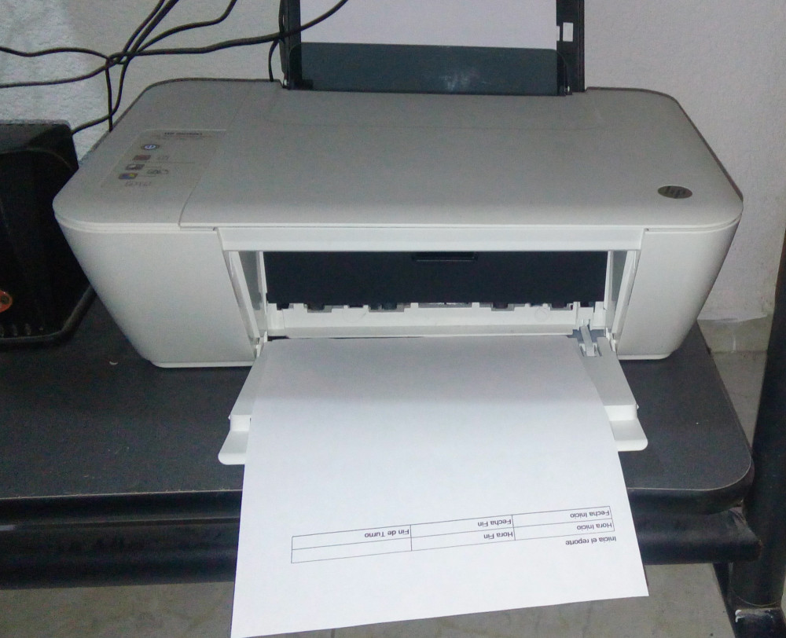
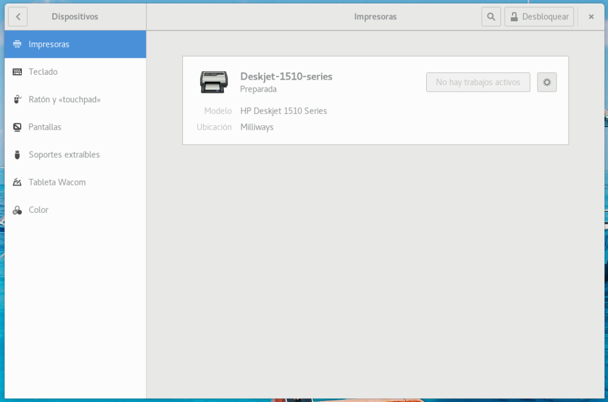
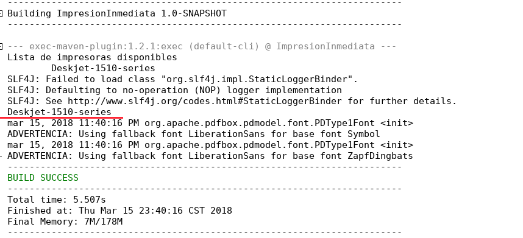

# Imprimiendo en Java SIN mostrar el diálogo de impresión



Si se decida a programar sistemas hechos a la medida para diferentes negocios el generar reportes no debiera ser algo inusual, mucho menos que el cliente pida que se puedan mandar a la impresora pero ¿Que tal que el cliente pida que un reporte se imprima a una hora especifica?, esto suele tener un detalle inesperado, el que se imprima incluso si no hay nadie en la oficina para presionar el botón Imprimir, ¿Suena complicado?, ¿Algo que solo se puede hacer vía un cable serial y mandando los bits directamente?, nada de eso, aquí le digo como.

Para esto nos basaremos en lo visto en una entrada previa, por lo que le recomiendo le eche un vistazo si no lo ha hecho ya.

Ya que halla refrescado su memoria veamos como mandar algo a la impresora sin mostrar el dialogo de impresión o pedir permiso al usuario (Obviamente solo usara este poder para el bien, ¿verdad?).

## Teoría
De las entradas anteriores con la librería PdfBox seguro recordara el la clase PrinterJob es la que se encarga de mandar el documento a la impresora y para indicar la impresora necesitamos llamar al método printDialog, este nos deja seleccionar la impresora y nos pide la confirmación, pero esta no es la única forma de indicar la impresora.

Esto lo hacemos con la clase PrintService esta nos deja indicar directamente a PrinterJob la impresora saltandonos el dialogo de selección de impresora y la confirmación.

Ahora ¿Como creamos ese objeto PrintService? bueno para eso necesitamos dos cosas, primero saber el nombre exacto de la impresora que desea usar, hay dos formas de hacer esto, una es ver el dialogo de impresoras del sistema operativo, como se ve en la figura.



La otra es ejecutar la siguiente función la cual le listara todas las impresoras disponibles en su sistema.

```java
public void listarImpresoras() {
    PrintService[] printServices = PrintServiceLookup.lookupPrintServices(null, null);
    System.out.println("Lista de impresoras disponibles");

    for (PrintService printService : printServices) {
        System.out.println("\t" + printService.getName());
    }
}
```

Esta función le presentara en pantalla un listado completo de las impresoras del sistema, recuerde correrla en un proyecto que incluya PdfBox, la salida sera similar a la figura.



Como puede ver en el código de la función de búsqueda, la lista completa de impresoras nos la proporciono el método PrintServiceLookup.lookupPrintServices(null, null); el cual listo todas las impresoras, bueno usando esa misma idea podemos crear un método que nos regrese la impresora con el nombre indicado que seria como se ve a continuación

```java
private PrintService findPrintService(String printerName) {
    PrintService[] printServices = PrintServiceLookup.lookupPrintServices(null, null);
    for (PrintService printService : printServices) {
        System.out.println(printService.getName());

        if (printService.getName().trim().equals(printerName)) {
            return printService;
        }
    }
    return null;
}
```

Basta con pasarle de parámetro el nombre de la impresora que deseamos usar y nos regresara el PrintService adecuado.

Lo ultimo que necesitaría hacer ya que tenga el PrintService es indicarle al objeto PrinterJob que deseamos usar ese PrintService, esto se logra con una sola linea de código que es:

```java
printerJob.setPrintService(myPrintService);
```

Hecho esto basta con llamar el método print() y el documento se enviara directo a la impresora.

Pero para hacer mas claro todo veamos un ejemplo.

```java
/*
 * To change this license header, choose License Headers in Project Properties.
 * To change this template file, choose Tools | Templates
 * and open the template in the editor.
 */
package mx.hash.impresioninmediata;

import com.itextpdf.kernel.geom.PageSize;
import com.itextpdf.kernel.pdf.PdfDocument;
import com.itextpdf.kernel.pdf.PdfWriter;
import com.itextpdf.layout.Document;
import com.itextpdf.layout.element.Paragraph;
import com.itextpdf.layout.element.Table;
import java.awt.print.PrinterException;
import java.awt.print.PrinterJob;
import java.io.ByteArrayInputStream;
import java.io.ByteArrayOutputStream;
import java.io.IOException;
import java.util.logging.Level;
import java.util.logging.Logger;
import javax.print.PrintService;
import javax.print.PrintServiceLookup;
import javax.swing.JOptionPane;
import org.apache.pdfbox.pdmodel.PDDocument;
import org.apache.pdfbox.printing.PDFPageable;

/**
 *
 * @author david
 */
public class ImpresionInmediata {

 private final static Logger LOGGER = Logger.getLogger("mx.hash.impresioninmediata.ImpresionInmediata");

 static public void main(String[] args) {
  ImpresionInmediata printer = new ImpresionInmediata();

  printer.listarImpresoras();

  try {
   ByteArrayOutputStream documentoBytes = printer.crearDocumentoiText();
   printer.imprimir(documentoBytes);
  } catch (IOException | PrinterException ex) {
   JOptionPane.showMessageDialog(null, "Error de impresion", "Error", JOptionPane.ERROR_MESSAGE);
   LOGGER.log(Level.SEVERE, null, ex);
  }
 }

 /**
  * Envia a imprimir el ByteArrayOutoutStream creado de un documento iText
  *
  * @param documentoBytes
  * @throws IOException
  * @throws PrinterException
  */
 public void imprimir(ByteArrayOutputStream documentoBytes) throws IOException, PrinterException {

  // Aqui convertimos la el arreglo de salida a uno de entrada que podemos
  // mandar a la impresora
  ByteArrayInputStream bais = new ByteArrayInputStream(documentoBytes.toByteArray());

  // Creamos un PDDocument con el arreglo de entrada que creamos
  PDDocument document = PDDocument.load(bais);

  PrintService myPrintService = this.findPrintService("Deskjet-1510-series");
  PrinterJob printerJob = PrinterJob.getPrinterJob();

  printerJob.setPageable(new PDFPageable(document));
  printerJob.setPrintService(myPrintService);

  printerJob.print();

 }

 /**
  * Muestra en pantalla la lista de todas las impresoras disponibles en el
  * sistema
  */
 public void listarImpresoras() {
  PrintService[] printServices = PrintServiceLookup.lookupPrintServices(null, null);
  System.out.println("Lista de impresoras disponibles");

  for (PrintService printService: printServices) {
   System.out.println("\t" + printService.getName());
  }
 }

 /**
  * Nos regresa el PrintService que representa la impresora con el nombre que
  * le indiquemos
  * @param printerName nombre de la impresora que deseamos usar
  * @return PrintService que representa la impresora que deseamos usar
  */
 private PrintService findPrintService(String printerName) {
  PrintService[] printServices = PrintServiceLookup.lookupPrintServices(null, null);
  for (PrintService printService: printServices) {
   System.out.println(printService.getName());

   if (printService.getName().trim().equals(printerName)) {
    return printService;
   }
  }
  return null;
 }

 /**
  * Crea un documento via la libreria iText y lo almacena como un
  * ByteArrayOutputStream
  *
  * @return Documento iText en formato ByteArrayOutputStream
  */
 public ByteArrayOutputStream crearDocumentoiText() {
  // Es en este ByteArrayOutputStream donde se pone el documento una vez
  // que se llama a documento.close()
  ByteArrayOutputStream documentoBytes = new ByteArrayOutputStream();

  PdfWriter pdfWriter = new PdfWriter(documentoBytes);
  PdfDocument pdfDoc = new PdfDocument(pdfWriter);

  Document documento = new Document(pdfDoc, PageSize.LETTER);
  documento.add(new Paragraph("Inicia el reporte"));
  documento.add(this.crearTabla());

  documento.close();

  return documentoBytes;
 }

 private Table crearTabla() {
  float[] anchos = {
   50 F,
   50 F,
   50 F
  };
  Table tablaEncabezado = new Table(anchos);

  tablaEncabezado.setWidth(500 F);

  tablaEncabezado.addCell("Hora Inicio");
  tablaEncabezado.addCell("Hora Fin");
  tablaEncabezado.addCell("");
  tablaEncabezado.addCell("Fecha Inicio");
  tablaEncabezado.addCell("Fecha Fin");
  tablaEncabezado.addCell("Fin de Turno");

  return tablaEncabezado;
 }

}
```

Al correr este ejemplo muy posiblemente la indicara un error (a menos que por casualidad su impresora se llama exactamente igual que la mia), no se preocupe al correr el programa la lista completa de impresoras aparecerá en pantalla, solamente vea cual impresora desea usar y acomode la siguiente linea

```java
PrintService myPrintService = this.findPrintService("Deskjet-1510-series");
```

Poniendo el nombre de la impresora como argumento a esa función, hecho esto el documento se imprimirá la siguiente vez que corra el programa.
